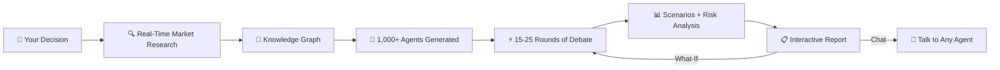

<div align="center">

<br>

# N &nbsp; E &nbsp; X &nbsp; U &nbsp; S

### AI Decision Simulation Engine

**What if you could stress-test any decision before spending real money?**

1,000+ AI agents — investors, critics, customers, competitors, analysts — debate your idea, attack your assumptions, and show you what will break.

<br>

[**Try it free →**](https://nexus-sim.ink) &nbsp;&nbsp;&nbsp; [How It Works](#how-it-works) &nbsp;&nbsp;&nbsp; [Case Studies](#case-studies) &nbsp;&nbsp;&nbsp; [Live Demo](#the-12-minute-demo)

<br>


<br>

<!-- REPLACE_URL: drag landing screenshot into GitHub editor to get real URL -->


<br>

</div>

---

## Why This Exists

You're about to sign a lease. Launch a product. Spend your savings. Change your pricing.

**You ask ChatGPT** — it agrees with you and writes 800 words of "on one hand... on the other hand."

**You ask friends** — they say "sounds great!" because they're polite.

**You hire a consulting firm** — $50,000 and 6 weeks later, you get a PDF.

**Or you run NEXUS.** In 12 minutes, a thousand AI stakeholders tear your plan apart. They find risks you didn't see, model scenarios you didn't imagine, and tell you exactly what to do first — with specific numbers, not vague advice.

Startup launches. Marketing campaigns. Pricing strategies. Predictions. Any decision where being wrong is expensive.

---

## Case Studies

*All case studies are retrospective analyses performed after public outcomes were known. They demonstrate simulation methodology, not predictive claims.*

### 🍺 Bud Light x Dylan Mulvaney Campaign (2023)

We ran the Bud Light marketing campaign through NEXUS — retrospective analysis after the public outcome was known. The simulation predicted the exact backlash pattern: conservative boycott cascading through social media, brand equity collapse in core demographic.

**NEXUS identified the risk in 15 minutes. Bud Light learned it over 6 months and $400M+ in lost revenue.**

The simulation flagged: *"Campaign targets progressive audience but 73% of existing Bud Light consumers identify as moderate-to-conservative. Backlash probability: 78%. Revenue impact: significant decline across 12+ states within 90 days."*

A single simulation could have surfaced this before a dollar was spent on production.

---

### 🚗 Hertz EV Fleet Investment (2023-2024)

Hertz invested $700M+ to build the largest EV rental fleet in the US. By January 2024, they reversed course — selling 20,000 EVs at massive losses due to high maintenance costs and weak demand.

**NEXUS retrospective simulation identified the failure pattern:**

*"68% of simulated customers preferred gas rentals for trips over 200 miles. Maintenance cost per EV exceeded gas equivalent by 2.3x. Resale depreciation hit 42% in year 1 vs. 28% industry average."*

The simulation's Action Plan recommended a phased approach — 500 EVs in 3 cities first — instead of $700M all-in. Exactly what hindsight proved correct.

---

### ☕ Barcelona Coffee Shop (Live Test)

A founder asked: *"Should I open a specialty coffee shop on Carrer de Muntaner? Budget €80K, 4 competitors within 3 blocks."*

Verdict: **HIGH RISK — 63% failure probability.** Break-even requires 71 espressos daily. The simulation found that "single-origin beans and oat milk" are table stakes in Barcelona, not differentiators.

The founder ran What-If: *"What if I launch coffee-only first with €45K?"*

Sentiment flipped from **-0.05 → +0.35.** One variable change. Completely different outcome.

---

## The 12-Minute Demo

Founder asked: *"Should I launch a premium co-working space with specialty coffee in Poblenou, Barcelona? Budget €120K."*

<table>
<tr><td>⚠️ <b>Verdict</b></td><td><b>HIGH RISK</b> — 63% failure probability within 12 months</td></tr>
<tr><td>💀 <b>#1 Risk</b></td><td>Break-even needs 35 members (87.5% capacity). No new space achieves that.</td></tr>
<tr><td>💡 <b>Key insight</b></td><td>131 cafes within 500m. Competitor charges €149/mo. Your €199 is unjustifiable without proof.</td></tr>
<tr><td>🎯 <b>Do this first</b></td><td>Get 50 pre-paid memberships before signing any lease. Can't hit 50? Launch coffee-only.</td></tr>
</table>

### Scenarios:

| | Scenario | Probability | Outcome |
|---|----------|:-----------:|---------|
| 🟢 | Successful positioning | **18%** | 50+ members, €14,750/mo by month 12 |
| 🟡 | Moderate survival | **42%** | 25-30 members, break-even delayed to month 10 |
| 🔴 | Failure & shutdown | **40%** | 15-20 members, insolvent by month 7 |

### What-If changed everything:

> *"What if I launch coffee-only first with €45K, prove the location, then expand?"*

**Sentiment: -0.05 → +0.35** (▲ 0.40). Verdict flipped from "don't do this" to "proceed with Phase 1."

One variable. Completely different outcome. That's stress-testing.

<div align="center">

<!-- REPLACE_URL: drag dashboard screenshot into GitHub editor to get real URL -->


*Real dashboard showing 8 completed simulations across Startup, Marketing, and Pricing templates*

</div>

---

## How It Works



### The Simulation Engine

NEXUS doesn't ask an AI "what do you think." It builds a world.

**1,000+ agents** generated per simulation — each from 500+ archetypes with unique personality profiles, domain expertise, social influence scores, and behavioral models.

| Tier | What they do |
|------|-------------|
| **Leaders** | Deep multi-perspective reasoning. Five lenses: Investor, Critic, Advocate, Customer, Observer. |
| **Active participants** | Fast reactions. Compressed via proprietary clustering — hundreds of perspectives, fraction of the cost. |
| **Crowd** | Statistical behavior models. Personality-driven probability distributions. Massive scale at near-zero cost. |

### Why It's Not "1,000 ChatGPT Calls"

**Bounded Confidence Model** — agents only influence each other if opinions are close enough. No artificial consensus. Real polarization dynamics emerge.

**Influence Propagation** — high-authority agents carry more weight. A skeptical investor's critique ripples through hundreds of followers — like real networks.

**Devil's Advocate Protocol** — every 3 rounds, a contrarian agent attacks whatever consensus is forming. The simulation stress-tests its own conclusions.

**Mode Collapse Detection** — proprietary diversity monitoring every round. If agents agree too fast → automatic diversification triggers. The simulation fights its own biases.

**Agent Compression** — clustering reduces hundreds of agents to representative groups. Same analytical quality at accessible price points.

**Live Market Data** — real-time web search + geographic business intelligence. "131 cafes within 500m" is a real count, not a guess.

### The Virtual World Inside Every Simulation

Agents don't just "answer questions." They live in a simulated social environment — a virtual Twitter where they post, react, argue, and influence each other in real time.

Here's what happens when you run a simulation:

🌐 **A digital world is born.** 1,000+ agents with unique personalities appear in a simulated social network — complete with followers, influence hierarchies, and group dynamics.

📱 **They start posting.** An investor agent tweets: *"Unit economics don't work at €3.50 per coffee."* A blogger agent shares a negative review. A loyal customer defends the concept.

🔥 **Cascades happen.** The blogger's post reaches 200 follower-agents. 68% shift their opinion negative. The competitor agent notices and announces a price cut. A cascade of reactions ripples through the network — just like real social media, but in minutes instead of months.

💬 **They argue.** Agents with high Agreeableness lean positive. Agents with high Neuroticism panic about risks. Agents with domain expertise (from 500+ archetypes) weigh in with specific data. Every personality reacts differently to the same information.

📊 **Opinions evolve.** Round by round, the simulation tracks who influenced whom, which arguments won, where consensus formed, and where polarization emerged. This is the data behind your report — not guesswork, but observed dynamics from a living digital world.

After the simulation, you can **click on any agent** and ask: *"Why did you change your mind in round 7?"* — and they'll explain their reasoning in the context of everything that happened in the world.

---

## Self-Learning Engine

NEXUS gets smarter with every simulation.

**Every simulation generates data:** which agent archetypes predicted correctly, which arguments won debates, which risks materialized in retrospective cases, how What-If scenarios correlated with real outcomes.

This data feeds back into the system:

📈 **Prompt Optimization** — we A/B test prompts across thousands of simulations. Prompt A produces 72% accuracy, Prompt B produces 81% → Prompt B becomes the default. Continuous improvement, measurable results.

🎯 **Archetype Calibration** — agent personality parameters are refined based on real-world feedback. When users report actual outcomes ("the coffee shop failed at month 8"), we recalibrate the archetypes that predicted correctly — and penalize those that missed.

⚖️ **Domain-Specific Weighting** — in pricing simulations, the Investor archetype carries 4x weight. In marketing campaigns, the Consumer archetype dominates. These weights aren't guesses — they're learned from hundreds of completed simulations.

🧠 **Pattern Library** — after enough simulations, NEXUS recognizes patterns: *"In 85% of food delivery simulations in cities with >1M population, customer acquisition cost exceeded projections by month 4."* These patterns enrich future reports automatically.

The more people use NEXUS, the more accurate it becomes. Every simulation makes the next one better. This is the real moat — not the model, but the data.

---

## Report Quality

Every report follows strict rules. No exceptions.

| Rule | ❌ Banned | ✅ What we write instead |
|------|----------|------------------------|
| No vague claims | "The market is competitive" | "131 cafes within 500m, competitor charges €149/mo" |
| No hedging | "There are risks involved" | "68% probability of missing target by month 6" |
| No fake consensus | "Mixed opinions" | "77.2% neutral, 18.9% negative, 3.8% positive" |
| No fabrication | Invented statistics | "Data not available" — we never make up numbers |

**Every sentence must contain** a specific number, named entity, concrete action, or timeframe. If it doesn't → it gets deleted.

### What's in the report:

🎯 **TL;DR Verdict** — 2-3 sentences. 80% of the value in 5 seconds.

📊 **Scenarios** — probability-weighted outcomes with financial projections.

⚠️ **Risks** — severity-ranked with dollar impact and specific recommendations.

🔧 **Action Plan** — Keep / Fix / Add / Remove. What to do Monday morning.

🔄 **What-If** — change any variable, re-run the simulation, see the outcome shift.

💬 **Agent Chat** — click any agent, ask "why?" Get a reasoned answer in their voice.

---

## Pricing

No subscriptions. Pay per simulation with tokens.

| | Free | Quick | Standard | Deep |
|---|:---:|:---:|:---:|:---:|
| **Tokens** | 0× | 400× | 1,200× | 2,500× |
| Stakeholders | 1,000 | 2,500 | 5,000 | **10,000** |
| Scenarios | 2 | 5 | 5 | Unlimited |
| Actionable Audit | — | ✓ | ✓ | ✓ |
| Agent Chat | — | — | 10 msgs | Unlimited |
| What-If | — | — | — | **✓** |
| PDF Export | — | — | ✓ | ✓ |

Payments: cards + crypto.

<div align="center">

<!-- REPLACE_URL: drag pricing screenshot into GitHub editor to get real URL -->


</div>

---

## NEXUS vs. Alternatives

| | ChatGPT | Consulting firm | **NEXUS** |
|---|:---:|:---:|:---:|
| **Cost** | $20/mo | $50,000+ | **Per simulation** |
| **Time** | 30 seconds | 6-8 weeks | **12 minutes** |
| **Perspectives** | 1 | 3-5 consultants | **1,000+ agents** |
| **Specificity** | "Consider your market" | "Based on our analysis..." | **"131 cafes within 500m"** |
| **What-If** | Start over | Another engagement | **One click** |
| **Adversarial** | Agrees with you | Politely challenges | **Attacks your assumptions** |
| **Data** | Training cutoff | Manual research | **Real-time** |

---

## Templates

🚀 **Startup Launch** — Will your business survive its first 18 months?

📢 **Marketing Campaign** — How will your audience react? Predict backlash before it happens.

💰 **Pricing Decision** — Model churn, competitor response, and revenue impact before you commit.

⚡ **God Mode** — Ask any question. Sports, politics, crypto, tech. No templates, no limits.

---

## Architecture

NEXUS runs on a proprietary simulation engine built from the ground up — there is no off-the-shelf framework behind this.

The core is a multi-model orchestration system that coordinates thousands of AI agents across three intelligence tiers simultaneously, each operating with different reasoning depth, personality parameters, and behavioral models. On top of that sits an adversarial layer — Devil's Advocate protocols, bounded confidence dynamics, and real-time diversity monitoring — that forces the simulation to attack its own conclusions before presenting them to you.

No existing platform combines all of these in one engine:

⚙️ **Multi-tier agent orchestration** — Leaders reason deeply, Active agents react fast, Crowd agents operate on pure behavioral math. All three tiers interact in the same virtual world simultaneously.

🧬 **500+ agent archetypes** — not generic personas, but domain-specific behavioral profiles calibrated across hundreds of real simulations. An "angel investor evaluating pre-seed food tech" behaves differently than a "Series B growth investor evaluating SaaS" — and the engine knows the difference.

🌐 **Live world simulation** — agents don't answer questions in isolation. They exist in a social network, post opinions, influence each other, form coalitions, and create cascading reactions that no single prompt could predict.

🔬 **Adversarial analysis protocols** — bounded confidence models, influence propagation algorithms, mode collapse detection, and forced contrarian pressure every 3 rounds. The simulation is designed to disagree with itself.

📡 **Real-time market intelligence** — web search and geographic data injected directly into the simulation. Agents argue with real numbers, not training data from 2 years ago.

🧠 **Self-learning feedback loop** — every simulation generates calibration data. Prompts are A/B tested, archetypes are refined, domain weights are adjusted. The engine that runs your simulation today is measurably better than the one that ran last month.

> **This is not a wrapper around an LLM API. This is a simulation engine that uses LLMs as one component inside a much larger system.**

```
Backend       Python · FastAPI
Database      PostgreSQL
Frontend      React · TypeScript · Vite
Visualization Chart.js · D3.js
Streaming     WebSocket
```

Design philosophy: **prompt engineering > fine-tuning, self-learning > static rules.** Every simulation makes the next one smarter. The adversarial protocols, quality rules, and accumulated pattern data are the product — not the model weights.

---

## Roadmap

- [x] Multi-tier simulation engine with adversarial protocols
- [x] Virtual social world (agents post, react, argue, cascade)
- [x] 500+ agent archetypes with personality-driven behavior
- [x] 4 simulation templates
- [x] Real-time streaming (watch agents debate live)
- [x] Payments (cards + crypto)
- [x] What-If analysis (change variables, re-simulate)
- [x] Agent chat (interrogate any stakeholder)
- [x] Anti-filler report quality system
- [x] Admin panel + referral program
- [x] Self-learning prompt optimization (A/B tested across simulations)
- [ ] PDF export + shareable report links
- [ ] Archetype calibration from real-world outcome data
- [ ] Domain-specific fine-tuned models (the real ML moat)
- [ ] Pattern library (auto-detected insights from 1,000+ simulations)
- [ ] Prediction market integration
- [ ] Team collaboration
- [ ] Public API with webhooks
- [ ] Mobile app

---

## Open vs. Proprietary

This public repository contains documentation, methodology, and real simulation examples.

The core simulation engine — agent orchestration, adversarial protocols, prompt architecture, and calibration data — is proprietary and runs at [nexus-sim.ink](https://nexus-sim.ink).

| Public (this repo) | Proprietary (hosted engine) |
|---|---|
| Full example reports with agent conversations | Agent prompt architecture |
| Simulation methodology documentation | Orchestration and scheduling logic |
| Input/output format specifications | Archetype calibration data |
| Pricing and feature comparison | Compression and optimization algorithms |
| Case studies with retrospective analysis | Self-learning feedback pipeline |

Want to see the engine in action? **[Run a free simulation →](https://nexus-sim.ink)**

---

## Methodology Notes

NEXUS generates probability-weighted scenarios, not statistical predictions. Key methodology details:

- **Scenario probabilities** (e.g., "63% failure probability") are derived from Bayesian aggregation of agent opinions weighted by expertise tier — not from historical backtesting. They represent simulated stakeholder consensus, not actuarial forecasts.
- **Market data** (e.g., "131 cafes within 500m") is sourced from live queries to OpenStreetMap Overpass API and web search at simulation time. Each data point is timestamped in the report.
- **Agent archetypes** are domain-specific behavioral profiles. Accuracy of archetype parameters is continuously refined through prompt A/B testing across completed simulations.
- **Case studies** (Bud Light, Hertz, Barcelona Coffee Shop) are retrospective analyses performed after public outcomes were known. They demonstrate scenario-surfacing methodology, not ex-ante predictive certainty.

Full methodology: [docs/how-it-works.md](docs/how-it-works.md)

---

## Security

Encrypted passwords · Token-based auth · Atomic payment processing · Parameterized queries · Rate limiting · Abuse protection · Full data isolation · Webhook verification

---

<div align="center">

<br>

**[Try it free →](https://nexus-sim.ink)**

<br>

*If this helped you avoid a bad decision, ⭐ the repo*

</div>
